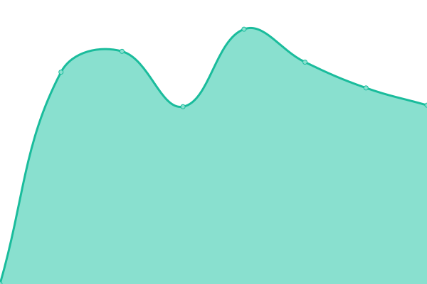
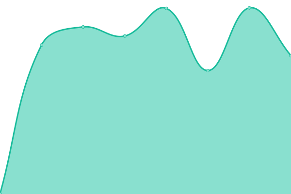
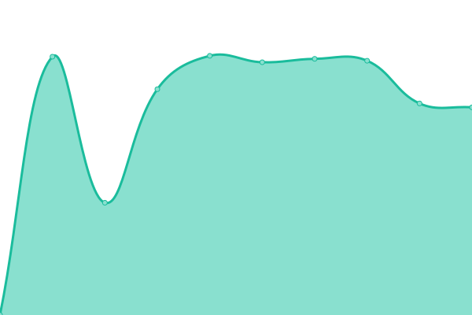

# [📈 Live Status](https://rootgrandfather.github.io/upptime): <!--live status--> **所有系统都可以正常运行**

This repository contains the open-source uptime monitor and status page for [xiaobzz](https://rootgrandfather.github.io/upptime), powered by [Upptime](https://github.com/upptime/upptime).

With [Upptime](https://upptime.js.org), you can get your own unlimited and free uptime monitor and status page, powered entirely by a GitHub repository. We use [Issues](https://github.com/rootgrandfather/upptime/issues) as incident reports, [Actions](https://github.com/rootgrandfather/upptime/actions) as uptime monitors, and [Pages](https://rootgrandfather.github.io/upptime) for the status page.

<!--start: status pages-->
<!-- This summary is generated by Upptime (https://github.com/upptime/upptime) -->
<!-- Do not edit this manually, your changes will be overwritten -->
<!-- prettier-ignore -->
| 链接 | 状态 | 历史 | 响应时间 | 正常运行时间 |
| --- | ------ | ------- | ------------- | ------ |
|  [www.idocdown](https://www.idocdown.com) | 🟩 正常运行 | [www-idocdown.yml](https://github.com/rootgrandfather/upptime/commits/HEAD/history/www-idocdown.yml) | 

 1693毫秒
     
 | 

<a href="https://rootgrandfather.github.io/upptime/history/www-idocdown">100.00%</a>
    

|  [airunfast](https://www.airunfast.com) | 🟩 正常运行 | [airunfast.yml](https://github.com/rootgrandfather/upptime/commits/HEAD/history/airunfast.yml) | 

 1275毫秒
     
 | 

<a href="https://rootgrandfather.github.io/upptime/history/airunfast">100.00%</a>
    

|  [it.idocdown](https://it.idocdown.com) | 🟩 正常运行 | [it-idocdown.yml](https://github.com/rootgrandfather/upptime/commits/HEAD/history/it-idocdown.yml) | 

 2240毫秒
     
 | 

<a href="https://rootgrandfather.github.io/upptime/history/it-idocdown">100.00%</a>
    

<!--end: status pages-->

[**Visit our status website →**](https://rootgrandfather.github.io/upptime)

## 📄 License

- Powered by: [Upptime](https://github.com/upptime/upptime)
- Code: [MIT](./LICENSE) © [Anand Chowdhary](https://anandchowdhary.com), supported by [Pabio](https://pabio.com)
- Data in the `./history` directory: [Open Database License](https://opendatacommons.org/licenses/odbl/1-0/)
